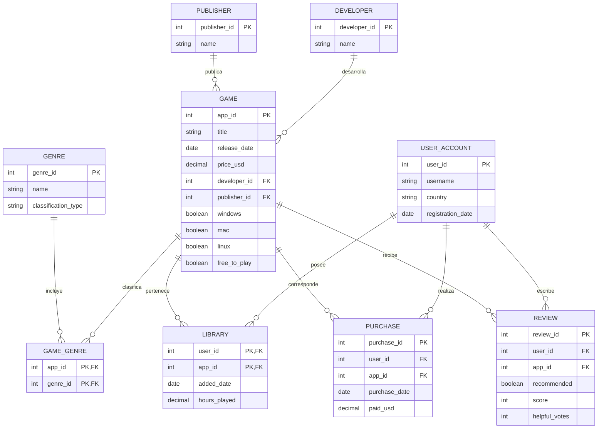

# Dataset Steam para ReLaX

Dataset para practicar álgebra relacional con
[ReLaX](https://github.com/dbis-uibk/relax). 

El catálogo está basado en datos públicos de Steam. Los usuarios y su actividad
son datos sintéticos creados exclusivamente para uso académico.



Las claves primarias de `GameGenre` y `Library` son compuestas. Cada juego
referencia exactamente un desarrollador y un publisher; las demás entidades
principales pueden existir sin registros asociados.

## Levantar la aplicación

Desde este directorio, ejecutar:

```bash
docker compose up --build -d
```

Abrir en el navegador:

```text
http://localhost:8088
```

## Detener la aplicación

```bash
docker compose down
```

Para consultar los logs:

```bash
docker compose logs -f
```
