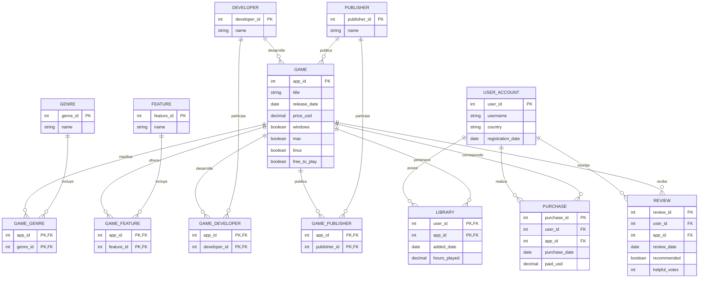

# Dataset Steam para ReLaX

Dataset para practicar álgebra relacional con
[ReLaX](https://github.com/dbis-uibk/relax). 

El catálogo está basado en datos públicos de Steam. Los usuarios y su actividad
son datos sintéticos creados exclusivamente para uso académico.



Las relaciones puente y `Library` tienen claves primarias compuestas. Juegos,
desarrolladores y publishers se relacionan N:M.

## Regeneración y validación

`source/steam_catalog.json` es el snapshot versionado del catálogo obtenido de
los endpoints públicos de Steam Store. `generate_dataset.py` lo combina con
actividad sintética usando seed 42 y snapshot `2026-08-02`. No se debe editar
`datasets/local_groups` manualmente.

```bash
cd 01-steam
python3 generate_dataset.py
python3 generate_dataset.py --check
python3 validate_dataset.py
```

Para renovar deliberadamente el catálogo (requiere Internet):

```bash
python3 scrape_steam_catalog.py --games 200
```

El scraper usa el buscador y `appdetails` de Steam con región US e idioma inglés;
excluye DLC, próximos lanzamientos, precios desconocidos y fechas posteriores al
snapshot. La generación normal no realiza solicitudes de red.

El último comando valida PK, FK, duplicados, fechas, precios y los casos docentes
descritos en [teaching_cases.md](teaching_cases.md).

## Levantar la aplicación

Desde este directorio, ejecutar:

```bash
docker compose pull
docker compose up -d
```

La imagen de ReLaX es independiente del dataset. Docker Compose monta
`datasets/local_groups` en modo de solo lectura al iniciar el contenedor.

Para probar una imagen publicada en otra ubicación:

```bash
RELAX_IMAGE=ghcr.io/<owner>/<repository>:latest docker compose up -d
```

Abrir en el navegador:

```text
http://localhost:8088
```

## Detener la aplicación

```bash
docker compose down
```

Para consultar los logs:

```bash
docker compose logs -f
```
