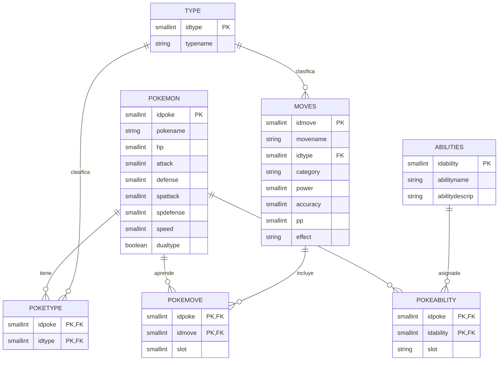

# Dataset Pokemon para ReLaX

Dataset adaptado al esquema del diagrama provisto para practicar algebra
relacional con [ReLaX](https://github.com/dbis-uibk/relax).

## Esquema


## Levantar la aplicacion

Desde este directorio, ejecutar:

```bash
docker compose up --build -d
```

Abrir `http://localhost:8089`. El puerto difiere del dataset de Steam para que
ambos contenedores puedan ejecutarse simultaneamente.

Para detenerlo:

```bash
docker compose down
```
